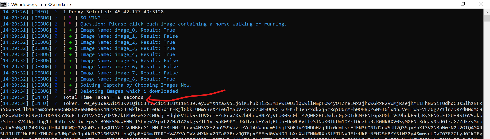
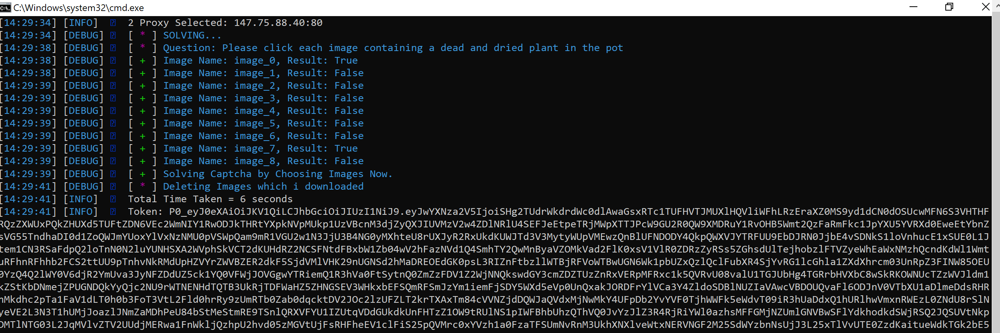
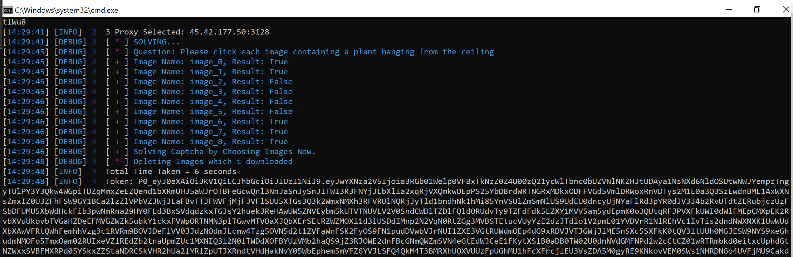

# hcaptcha-solver
## Say GoodBye to Paid Hcaptcha Solvers.
Rather than opening a browser and solving hcaptcha, this code **sovles hcaptcha by sending requests**. This way you will get the captcha_key or token easily.

**Main.py** is initially coded to print the captcha_key upon successfully solving hcaptcha But you can edit it as you like.

## Installation
- Run the file named **install_requirements.bat**, it will install all the necessary `requirements` for this code.
- **Dont touch config.ini**
- Run the file named **downloadorUpdate_models.bat**, it will download all the `models for the ai captcha solver.`
- you need a chromedriver. Based on your chrome version:
       Goto your chrome installation folder, usually its installed in `C:\Program Files\Google\Chrome\Application`. You must find a folder named something like this 105.0.5195.127, it can be different for you. Thats your chrome version. 
	   Goto [chrome driver download](https://chromedriver.chromium.org/downloads "chrome driver download") and download your chrome driver. Paste it in **data** folder.
-   You need some good **proxies** for the requests sent. You can find them at [proxy scrapper](https://github.com/DsCookieMaster/hcaptcah-proxy-scraper-checker "proxy scrapper"). It wills scrap proxies for hcaptcha site. Add the proxies to **proxies.txt file** in **data folder**
- To test the captcha solver, Run the file named **run_program.bat**.

## Some updates you need to do manually
You need to **keep objects.yaml updated** incase any new models has been added.
1. Goto `modules > ai_finder`, open objects.yaml with notepad. 
2. Goto [updated objects.yaml](https://raw.githubusercontent.com/QIN2DIM/hcaptcha-challenger/main/src/objects.yaml "updated objects.yaml").
3. Compare the **last lines** of the link with objects.yaml file. If they are different, add them to the end of objects.yaml and save.

## main.py
This file contains the important code at line 38.

### Issues or great ideas to improve code
1. If you faced any `unknown errors`, **First search them in stackoverflow**. If not found,* Open an issue in this repo.*

2. If you got a great idea to improve this code, pull a request or hit me up on discord (You can find it in the end of this readme).

3. Most importantly, if any error occured and the output **did not show** `Deleting images which i downloaded`. You will find the images in folder `data > captcha_temp_images`. Open an issue with the output and images.

##### Errors you might get:
1. **Max ssl error**, i have no idea how to solve it rather than putting a time.sleep at line 128 before making request in `modules > hcaptcha > challenges.py`
2. ignore error alike: **No models has been trained for such type of captcha yet.**

##### Ai Captcha Solver Reference:
1.  I modifed a couple of github codes. The fastest one i could come across was [this one](https://github.com/QIN2DIM/hcaptcha-challenger  "this one"). 
 His models dont have enough images, But still it works alot better than others. 

##### Some Proofs
Solves captcha in 10 Seconds.

------------

------------

------------

------------

### Reason why i started working on this project ?
I used many paid api's capmonster, anti-captcha, bought from github users, All of them had solving time of 15 to 30 seconds. Every one claims we are coming with a v2 update, then scams you!. Some sell outdated codes, and if you ask why it takes time. They ask you to Buy HQ proxies from them.

## If you got hcaptcha datasets, and would like to donate or give them to me for free, hit me up on my discord: Zerf#7071 

